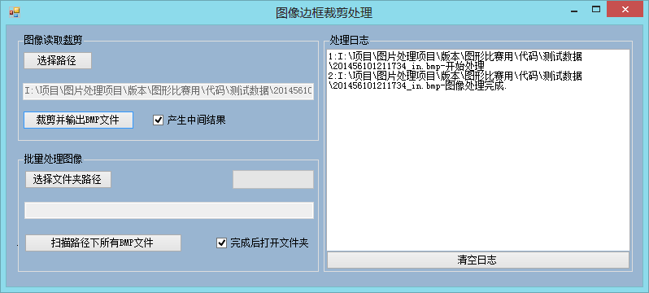
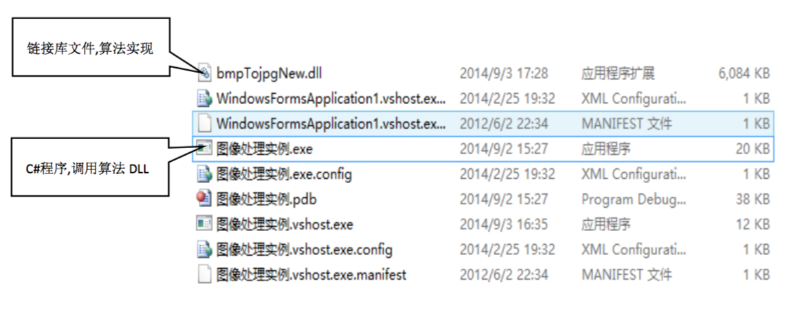
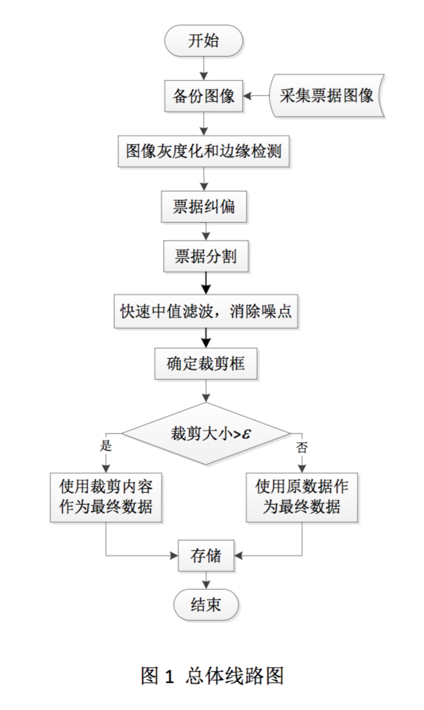

#票据裁剪控件
##简介
票据图片采集过程易受到复杂背景干扰和光照不足或不均等不利影响,使得自动、准确、实时裁
剪票据的任务很具有挑战性。“票据自动裁剪应用”这一项目针对真实数据,编写了一种实用的
票据自动裁剪控件,该控件应用到银行印控仪进行集成测试,结果表明本控件在自然光照和复杂背景环境中,能够很好的抑制背景干扰,准确裁剪票据。

##ScreenShots



##运行环境

.Net 4.0 或以上,使用 Microsoft Visual Studio 2010 编译


##应用使用说明
应用采用 c# Windows 应用程序为入口,调用 c 语言封装的 dll 算法文件,实现图片的处理。 应用程序组成部分如下图程序结构图 所示:

##方法
* 第一步,票据自动纠偏:采用自适应阈值 Canny 算子提取灰度图边缘,再通过 Hough 变换 确定票据偏转角度,进而完成票据纠偏;
* 第二步,票据自动裁剪:对纠偏后图像先进行分段线性变换,进行图像增强;采用自适应 阈值且 Sigma 参数较高的 Canny 算子提取灰度图边缘;快速中值滤波,快速中值滤波,消除杂点; 遍历搜索票据对角边界点,确定裁剪框。

